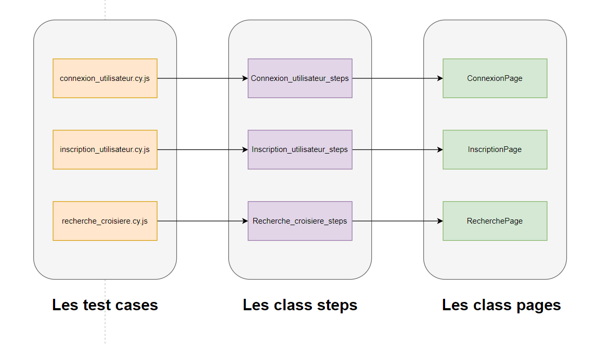

L'organisation du code repose sur 
- Les pages
- Les étapes (steps) 
- Les cas de test (test cases)

pour assurer la structure et le bon fonctionnement de l'application. 

***Les pages***

Trois pages crées :
- ConnexionPage.js
- InscriptionPage.js
- RecherchePage.js
  
Chaque fichier page represente une classe qui encapsule les attributs et les fonctionnalités spécifiques de la page correspendante.

Par exemple, le fichier "ConnexionPage.js" contient une classe  ConnexionPage qui regroupe les accesseurs de la page de connexion, tandis que le fichier "InscriptionPage.js" contient une classe "InscriptionPage"  qui regroupe les accesseurs de la page d'inscription.

===> Ces fichiers de page incluent des accesseurs aux objets HTML et ils suivent une convention de nommage cypress (l'extension ".js") ainsi la norme de nommage camelCase. 

***Les étapes***

Trois étapes crées :

- Connexion_utilisateur_steps.js
- Inscription_utilisateur_steps.js
- Recherche_croisiere_steps.js

Chaque fichier étape représente une classe qui encapsule les attributs et les fonctionnalités spécifiques à l'étape.

Chaque fonction de cette classe utilise les objets Pages. Elle répresente une étape, autrement dit une fonctionalité unitaire telles que "setFormulaire" (saisir les identifiants) ou "connexion" (cliquer sur le bouton de connexion). 

===> Ces fonctions n'accédent pas directement aux pages , mais ils instancient les classes Pages qui à leurs tours accédent directment au code HTML/CSS de site.

***Cas de test (test cases)***

Les cas de test regroupent les scénarios à tester, organisés dans des fichiers tels que:
- connexion_utilisateur.cy.js (3 cas de test)
- inscription_utilisateur.cy.js (4 cas de test)
- recherche_croisiere.cy.js (3 cas de test)

Chaque fichier de cas de test regroupe un ensemble de fonctions qui décrivent les étapes à exécuter et les vérifications à effectuer pour valider le comportement attendu de l'application. Les cas de test représentent les scénarios à tester.

==> Les fonctions de test utilisent les étapes définies dans les fichiers correspondants pour effectuer les actions requises sur les pages et vérifier les résultats obtenus.

***Describe/it:***
Les cas de test sont organisés à l'aide de blocs "describe" et de fonctions "it" pour une meilleure lisibilité et séparation des différents scénarios de test. La fonction describe permet de regrouper les cas de test liés à une fonctionnalité spécifique, tandis que la fonction it décrit un cas de test individuel à l'intérieur du bloc describe.
==> Cette structuration facilite la maintenance et la compréhension des tests, ainsi que l'identification rapide des éventuels problèmes ou erreurs.. 

***import/export:***
Il convient de noter que les imports et les constantes sont également présents dans le code pour assurer le bon fonctionnement de l'application.

-- Par exemple, nous importons la page d'inscription à l'aide de la déclaration suivante : import InscriptionPage from '../pages/InscriptionPage';

->Cet import permet d'inclure la classe "InscriptionPage" du fichier "InscriptionPage.js" situé dans le répertoire des pages. Une fois importée, nous créons une instance de cette page à l'aide de la déclaration suivante : const inscriptionPage = new InscriptionPage();

-- Autre exemple, dans le code l'import suivant est trop utilisé : require('@cypress/xpath'). Cet import indique l'utilisation de la bibliothèque @cypress/xpath pour utiliser des sélecteurs XPath dans vos tests.

De plus, dans le code il y'a l'export par défaut avec la syntaxe export default ConnexionPage;. Cela permet d'exporter la classe ConnexionPage en tant qu'export par défaut, ce qui signifie qu'elle peut être importée et utilisée dans d'autres fichiers.

***Lancer cypress***
Pour lancer Cypress, un fichier "runcy.bat" est créé. En lançant la commande correspondante, Cypress est automatiquement démarré.

